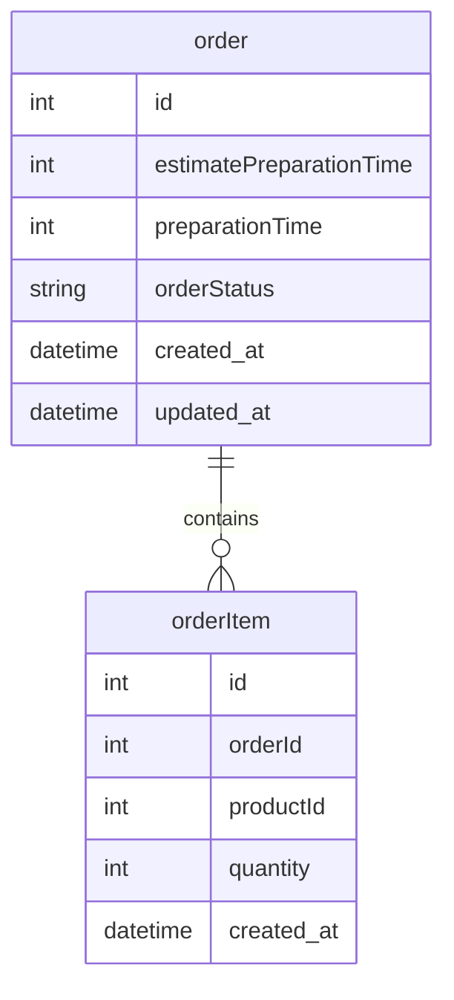

# Tech Challenge - Production 📦

## 📌 Sobre o Projeto

O **Tech Challenge - Production** é um dos módulos do ecossistema Tech Challenge, desenvolvido para gerenciar a produção de pedidos de forma eficiente. Ele permite o acompanhamento do fluxo de produção, desde o recebimento até a conclusão, garantindo maior controle e agilidade no processo.

## 🚀 Tecnologias Utilizadas

Este projeto foi desenvolvido utilizando as seguintes tecnologias e ferramentas:

- **NestJS** - Framework progressivo para Node.js
- **TypeScript** - Linguagem utilizada no desenvolvimento
- **TypeORM** - ORM para interação com banco de dados
- **PostgreSQL** - Banco de dados relacional
- **Docker** - Para conteinerização e execução isolada do ambiente
- **Jest** - Framework para testes unitários e de integração
- **SQS** - Para comunicação assíncrona entre serviços

## 📁 Estrutura do Projeto

```
tech-challenge-production/
│-- src/
│   │-- application/       # Casos de uso e regras de negócio
│   │-- domain/            # Entidades e contratos
│   │-- infrastructure/    # Repositórios e integrações
│   │-- presentation/      # Controllers e API REST
│   └-- main.ts            # Ponto de entrada da aplicação
│-- test/                 # Testes unitários e de integração
│-- .env                  # Variáveis de ambiente
│-- docker-compose.yml     # Configuração do ambiente Docker
│-- README.md              # Documentação do projeto
```

## 🔧 Como Executar o Projeto

### 📌 Pré-requisitos
Certifique-se de ter instalado em sua máquina:
- [Node.js](https://nodejs.org/)
- [Docker](https://www.docker.com/)
- [Docker Compose](https://docs.docker.com/compose/)

### 📥 Clonando o Repositório

```sh
git clone https://github.com/Grupo-26-FIAP/tech-challenge-production.git
cd tech-challenge-production
```

### 🚀 Rodando com Docker

```sh
docker-compose up --build
```

### 💻 Rodando localmente

1. Instale as dependências:
```sh
npm install
```

2. Configure o banco de dados no arquivo `.env`

3. Execute as migrações:
```sh
npm run typeorm migration:run
```

4. Inicie a aplicação:
```sh
npm run start
```

A API estará disponível em `http://localhost:3004`.

## ✅ Testes

Para rodar os testes unitários e de integração:

```sh
npm run test
```

Para rodar os testes com cobertura de código:

```sh
npm run test:cov
```

## 📬 Comunicação Entre Módulos

Este módulo se comunica com outros serviços via **SQS**, recebendo e enviando eventos para processamento de pedidos.

### Diagrama do Banco de Dados

O diagrama abaixo ilustra a estrutura das tabelas e suas relações:



## 🛠️ Contribuição

Ficamos felizes em receber contribuições! Para contribuir:
1. Fork o repositório
2. Crie uma branch (`git checkout -b feature/nova-feature`)
3. Commit suas alterações (`git commit -m 'Adicionando nova feature'`)
4. Faça push para a branch (`git push origin feature/nova-feature`)
5. Abra um Pull Request

## 👥 Time de Desenvolvimento

| Nome                           | RM           | E-mail                                                             | GitHub                                             |
| ------------------------------ | ------------ | ------------------------------------------------------------------ | -------------------------------------------------- |
| Jhoni Farias                   | **RM357358** | [jhonifarias.developer@gmail.com](jhonifarias.developer@gmail.com) | [@JhoniFarias](https://github.com/JhoniFarias)     |
| Josef Henrique Zambreti        | **RM357836** | [josefhenrique@uol.com.br](josefhenrique@uol.com.br)               | [@Josefhz](https://github.com/Josefhz)             |
| Lucas Rodrigues Medina Costa   | **RM357360** | [lucasmedinarmc@gmail.com](lucasmedinarmc@gmail.com)               | [@diname](https://github.com/diname)               |
| Kleber de Oliveira Andrade     | **RM358012** | [pdjkleber@gmail.com](pdjkleber@gmail.com)                         | [@kleberandrade](https://github.com/kleberandrade) |
| Vitória Camila Xavier Sobrinho | **RM357235** | [vcamilaxs@gmail.com](vcamilaxs@gmail.com)                         | [@itsvickie](https://github.com/itsvickie)         |

## 📄 Licença

Este projeto está sob a licença MIT. Veja o arquivo [LICENSE](LICENSE) para mais detalhes.

---

Feito com ❤️ pelo Grupo 26 - FIAP 🚀

